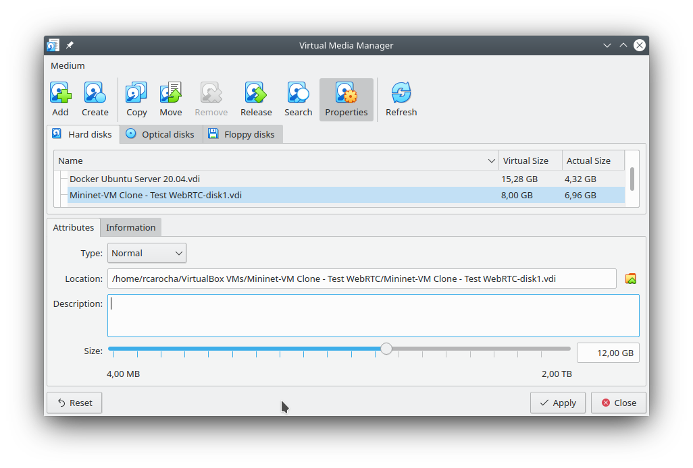

# Configuração da VM Mininet para Experimento com WebRTC

Vocês precisarão realizar diversas configurações prévias para realizar o laboratório com o WebRTC (laboratório 3.2). Essas configurações são um **pré-requisito** para o laboratório e devem ser feitas com **antecedência**.

Siga os procedimentos indicados abaixo

    2-virtual-media-manager.png
    3-vm-abrir-disks.png
    4.1-vm-disks-botao.png
    4-vm-disks-extended.png
    5-vm-disks-resize.png
    6-vm-disks-resize-filesystem.png
    7-vm-disks-resize-filesystem-resize.png
    7-vm-resize-ok.png
    8-git-clone-labs-auxilio.png
    9-script-confirmacao-apt-get.png
    10-parado-snapd.png

### Aumento do tamanho da VM

Neste experimento precisaremos instalar alguns programas e serviços adicionais que consumirão  bastante espaço na máquina virtual. Usualmente, a VM do Mininet não tem tamanho suficiente para permitir esta instalação, então o primeiro passo será aumentar o seu tamanho de 8Gb para 12Gb (tamanho que é mais que confortável).

File -> Virtual Media Manager

Selecionar em "Hard Disk" (Name) o disco que irá aumentar, no meu caso, "Mininet VM Clone - Test WebRTC-disk1.vdi"
Indicar o novo tamanho de 12Gb e clicar em "Apply".

Iniciar a máquina virtual. O novo tamanho não será automaticamente utilizado pela VM, pois a partição continuará do tamanho anterior. É necessário utilizar o utilitário "Disks" 

Clicar na partição extendida "Extended Partition Partition 2" e clicar no botão com duas engrenagens ("Additional Partition Options" e escolher "Resize". Aumentar para o tamanho máximo de 12Gb e clique no botão "Resize" (vermelho).

Feito isso, repetir para "Filesystem Partition 5", clicando no botão "Resize".

Reinicie a VM

Ao abrir um terminal e digitar `df -h` deve aparecer o novo tamanho disponível de 12Gb.

### Execução do script de instalação de dependências do laboratório

2. Executar o script de instalação dos requisitos do laboratório. Você deve realizar esse processo com tempo disponível. Na minha máquina esse processo durou 15min, mas deve ser mais longo dependendo da velocidade e memória da sua estação e acesso Internet.

Baixe todos os scripts do projeto Github <https://github.com/rcarocha-dcc-ufcat/labs-auxilio>, abrindo um terminal e executando comando git 

        git clone https://github.com/rcarocha-dcc-ufcat/labs-auxilio.git

Entre no diretório `labs-auxilio` com o conteúdo baixado, utilizando o comando `cd labs-auxilio`.

Execute o script utilizando o comando

sh setup-webrtc.sh

Este processo será demorado e poderá solicitar a senha do superusuário da estação para finalizar a configuração. Sempre que o programa solicitar confirmação para instalação de aplicações, aceite.

Este processo instalará:

* VLC
* Chromium
* v4l2loopback-dkms
* ffmpeg
* Docker
* Aplicação de Teste webRTC apprtc via Docker (que por sua vez, instalará diversas dependências)

Ao final, deverá aparecer a mensagem "Instalação TERMINADA!".

