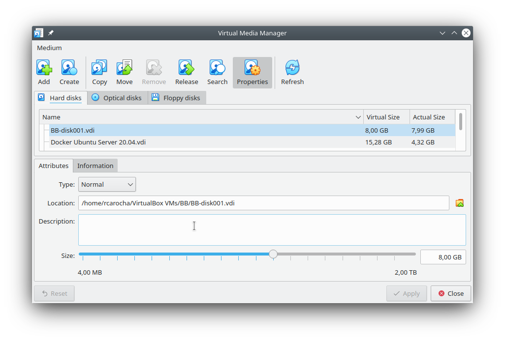
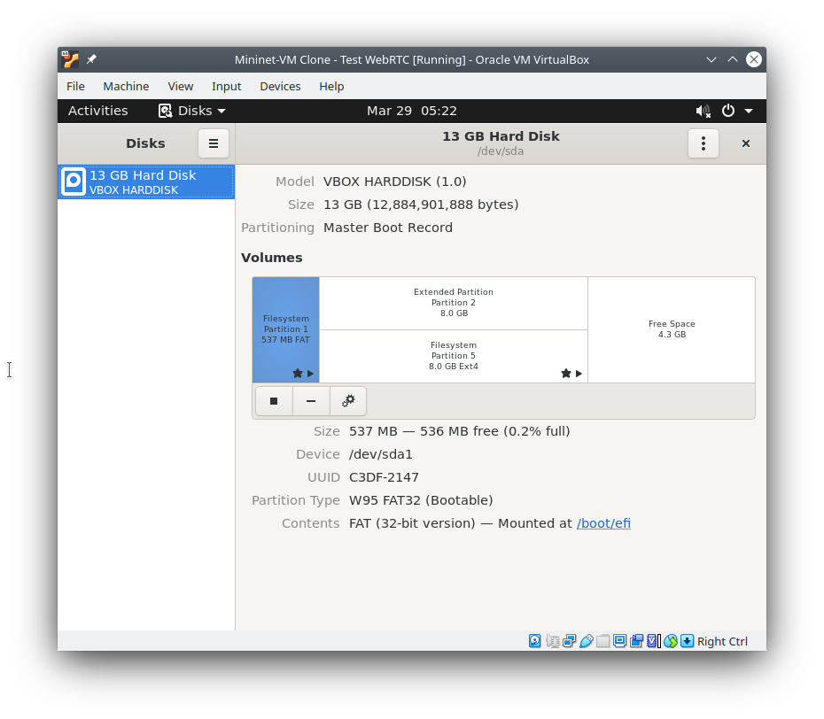
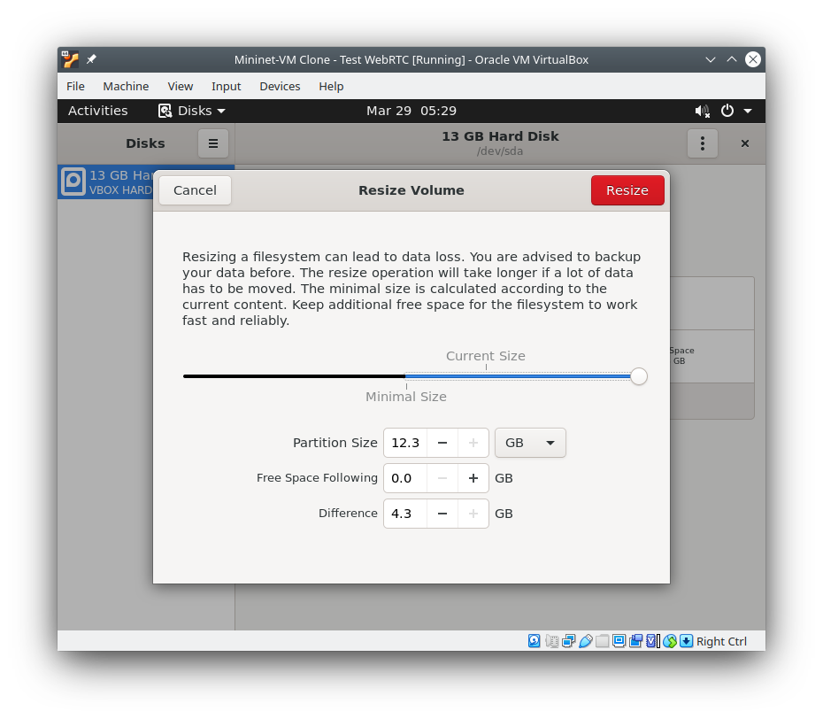
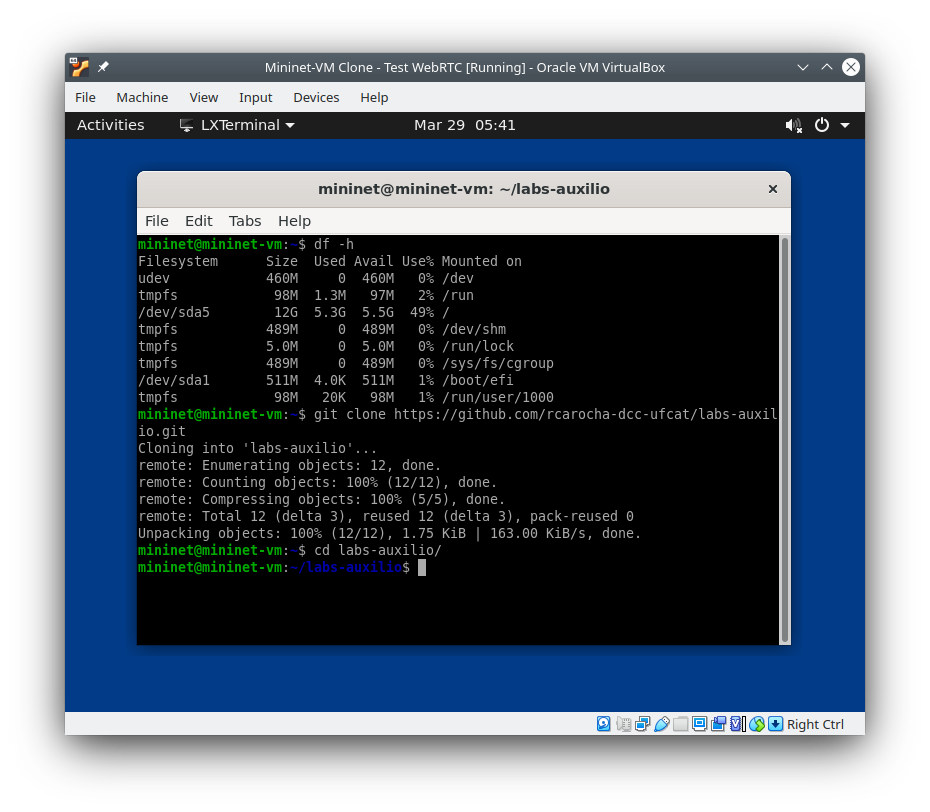
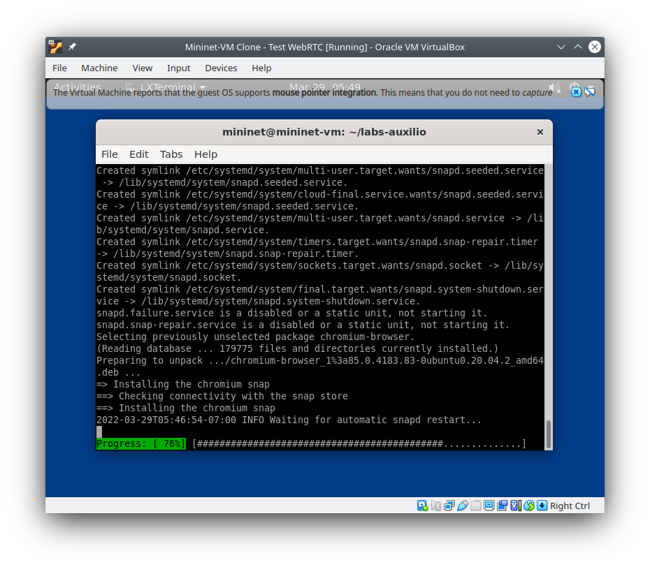
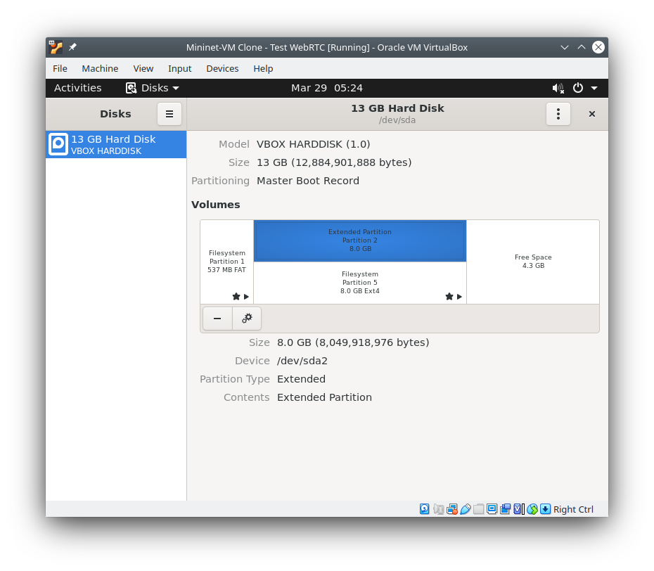
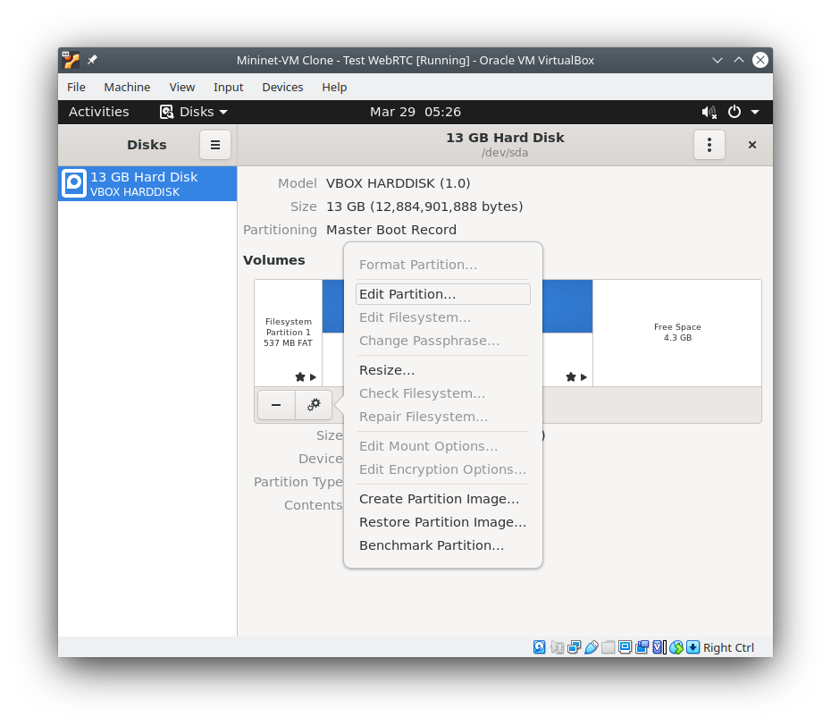
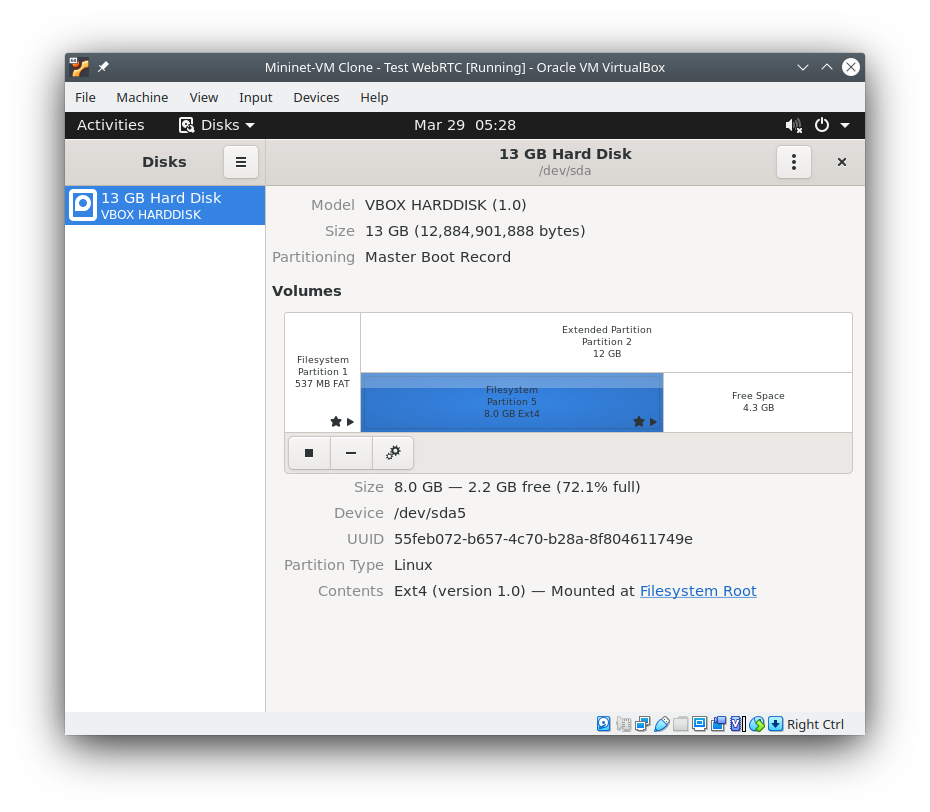
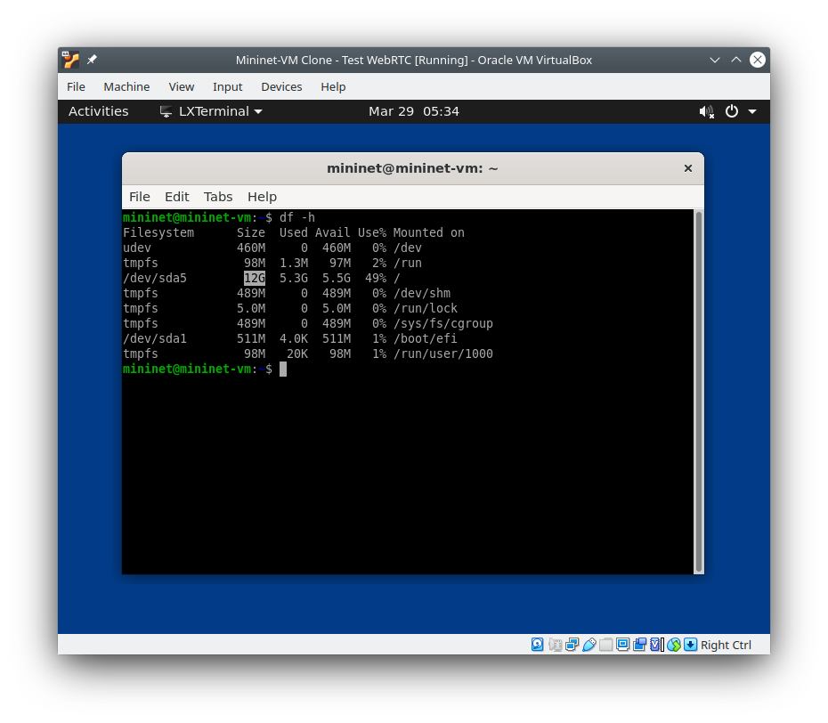
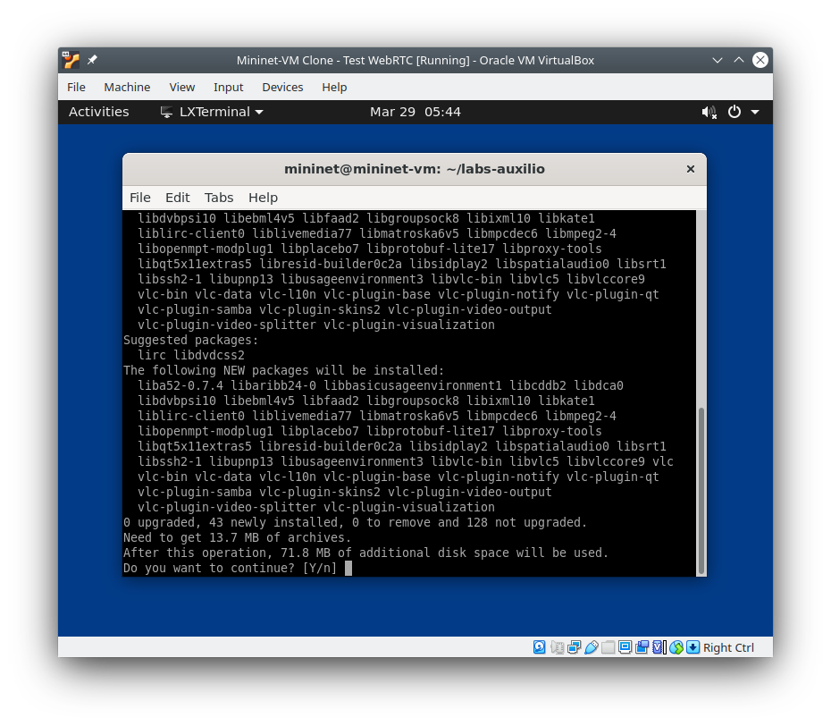

# Configuração da VM Mininet para Experimento com WebRTC

Vocês precisarão realizar diversas configurações prévias para realizar o laboratório com o WebRTC (laboratório 3.2). Essas configurações são um **pré-requisito** para o laboratório e devem ser feitas com **antecedência**.

Siga os procedimentos indicados abaixo.

<!-- 

4.1-vm-disks-botao.png

-->

### Aumento do tamanho da VM

Neste experimento precisaremos instalar alguns programas e serviços adicionais que consumirão  bastante espaço na máquina virtual. Usualmente, a VM do Mininet não tem tamanho suficiente para permitir esta instalação, então o primeiro passo será aumentar o seu tamanho de 8Gb para 12Gb (tamanho que é mais que confortável). Se o espaço na sua máquina estiver curto, experimente 10Gb ao invés de 12Gb. Para fazê-lo, siga os passos abaixo:

1. No VirtualBox, entre na opção do menu "File" e "Virtual Media Manager".
2. Selecionar em "Hard Disk" (Name) o disco que irá aumentar, no meu caso, "Mininet VM Clone - Test WebRTC-disk1.vdi". Indicar o novo tamanho de 12Gb e clicar em **"Apply"**.
  
3. Iniciar a máquina virtual. O novo tamanho não será automaticamente utilizado pela VM, pois a partição continua do tamanho anterior. É necessário utilizar o utilitário "Disks" para fazer o ajuste.
4. Clique na partição extendida "Extended Partition Partition 2" e clicar no botão com duas engrenagens ("Additional Partition Options" e escolher "Resize". Aumente para o tamanho máximo de 12Gb e clique no botão "Resize" (vermelho).
  
  
  
5. Feito isso, repetir para "Filesystem Partition 5", clicando no botão "Resize".

  
6. Reinicie a VM
7. Ao abrir um terminal e digitar `df -h` deve aparecer o novo tamanho disponível de 12Gb.

  

### Execução do script de instalação de dependências do laboratório

Neste passo, você irá executar o script de instalação dos requisitos do laboratório. **Você deve realizar esse processo com tempo disponível**. Na minha máquina esse processo durou 15min, mas deve ser mais longo dependendo da velocidade e memória da sua estação e acesso Internet.

1. Baixe todos os scripts do projeto Github <https://github.com/rcarocha-dcc-ufcat/labs-auxilio>, abrindo um terminal e executando o seguinte comando git 

        git clone https://github.com/rcarocha-dcc-ufcat/labs-auxilio.git
        
  
2. Entre no diretório `labs-auxilio` com o conteúdo baixado, utilizando o comando `cd labs-auxilio`.
3. Execute o script utilizando o seguinte comando

        sh setup-webrtc.sh

   Este processo será demorado e poderá solicitar a senha do superusuário da estação para finalizar a configuração. Sempre que o programa solicitar confirmação para instalação de aplicações, aceite.
   
   
   
   O processo ficará possivelmente parado um tempo na instalação do Chromium, esperando o reinício do snapd. Isso é normal. 
   
   

Este processo completo instalará:

* VLC
* Chromium
* v4l2loopback-dkms
* ffmpeg
* Docker
* Aplicação de Teste webRTC apprtc via Docker (que por sua vez, instalará diversas dependências)

Ao final, deverá aparecer a mensagem **"Instalação TERMINADA!"**.
